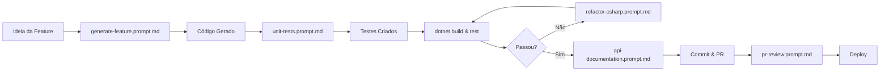

# 🤖 Guia Rápido: Prompts de IA

> Referência rápida para uso dos prompts de IA no SmartServe API

## 📂 Localização

Todos os prompts estão em: **`.github/prompts/`**

Documentação completa: [`.github/prompts/README.md`](.github/prompts/README.md)

## 🚀 Início Rápido

### No GitHub Copilot (Rider/VS)

Use `Ctrl+Shift+I` e digite:

```
@workspace Use o prompt .github/prompts/[categoria]/[arquivo].prompt.md 
para [descrever o que precisa]
```

### Exemplo Prático

```
@workspace Use o prompt .github/prompts/code/generate-feature.prompt.md 
para criar a feature de Avaliações (Reviews) com rating, comment e relacionamentos
```

## 📋 Prompts Disponíveis

### 🔧 Geração de Código (`code/`)

| Prompt | Uso | Gera |
|--------|-----|------|
| **generate-feature.prompt.md** | Feature completa do zero | Entidade, DTOs, Validator, Service, Controller |
| **generate-controller.prompt.md** | Controller RESTful | Endpoints CRUD com documentação |
| **generate-service.prompt.md** | Camada de serviço | Interface + Implementação + Lógica |
| **refactor-csharp.prompt.md** | Melhorar código existente | Refatoração seguindo SOLID |

### 📝 Documentação (`docs/`)

| Prompt | Uso | Gera |
|--------|-----|------|
| **create-readme.prompt.md** | Documentação do projeto | README.md completo |
| **api-documentation.prompt.md** | Documentar endpoints | XML comments + Swagger |

### 🔍 Code Review (`review/`)

| Prompt | Uso | Gera |
|--------|-----|------|
| **pr-review.prompt.md** | Revisar Pull Request | Checklist completo de review |
| **unit-tests.prompt.md** | Criar testes | xUnit + Moq + FluentAssertions |

### 🚀 DevOps (`devops/`)

| Prompt | Uso | Gera |
|--------|-----|------|
| **dockerfile.prompt.md** | Otimizar container | Dockerfile multi-stage otimizado |
| **azure-pipeline.prompt.md** | CI/CD completo | Pipeline Azure DevOps |

## 💡 Casos de Uso Comuns

### 1. Criar Nova Feature

```bash
# Passo 1: Gerar código
@workspace Use generate-feature.prompt.md para criar Review com rating e comment

# Passo 2: Gerar testes
@workspace Use unit-tests.prompt.md para ReviewService

# Passo 3: Documentar
@workspace Use api-documentation.prompt.md para ReviewController

# Passo 4: Validar
dotnet build && dotnet test
```

### 2. Revisar Pull Request

```bash
@workspace Use pr-review.prompt.md para revisar PR #123 
que adiciona módulo de pagamentos
```

### 3. Refatorar Código

```bash
@workspace Use refactor-csharp.prompt.md para melhorar 
SmartServe.Api/Application/Services/ProfessionalService.cs 
focando em performance
```

### 4. Setup DevOps

```bash
# Otimizar Docker
@workspace Use dockerfile.prompt.md para criar Dockerfile otimizado

# Configurar CI/CD
@workspace Use azure-pipeline.prompt.md para pipeline completo
```

## 🎯 Comandos Úteis Após Geração

### Validar Código
```bash
# Compilar
dotnet build

# Executar testes
dotnet test

# Verificar coverage
dotnet test /p:CollectCoverage=true

# Verificar erros
# Use get_errors no Copilot
```

### Aplicar Migrations
```bash
cd SmartServe.Api
dotnet ef migrations add AddReviewEntity
dotnet ef database update
```

### Testar API
```bash
# Iniciar API
dotnet run

# Acessar Swagger
# http://localhost:5000/swagger
```

## 📊 Workflow Completo de Feature



## 🎓 Dicas de Ouro

### ✅ Fazer
- Sempre usar `@workspace` para contexto
- Especificar nomes de arquivos e entidades
- Fornecer exemplos do projeto
- Validar com `dotnet build` depois

### ❌ Evitar
- Prompts vagos ("criar um service")
- Múltiplas features de uma vez
- Esquecer de executar testes
- Não revisar código gerado

## 🔗 Links Rápidos

- **Documentação Completa:** [`.github/prompts/README.md`](.github/prompts/README.md)
- **GETTING_STARTED:** [`GETTING_STARTED.md`](GETTING_STARTED.md)
- **README Principal:** [`README.md`](README.md)
- **Política de Git:** [`GIT_COMMIT_POLICY.md`](GIT_COMMIT_POLICY.md)

## 📦 Versionamento e Git

### ✅ COMITAR os Prompts

**SIM, os prompts DEVEM ser commitados!**

```bash
git add .github/prompts/
git add AI_PROMPTS_GUIDE.md
git commit -m "docs: Add AI prompts structure"
git push
```

**Por quê?**
- ✅ São documentação técnica (como README.md)
- ✅ Ajudam toda a equipe
- ✅ Evoluem com o projeto
- ✅ Facilitam onboarding
- ✅ Não contêm dados sensíveis

### ❌ NÃO Comitar

```bash
# Estes já estão no .gitignore
.env
bin/
obj/
*.user
*.log
.ai-conversations/  # Conversas privadas com IA
```

### 📋 Política Completa

Ver detalhes em: [`GIT_COMMIT_POLICY.md`](GIT_COMMIT_POLICY.md)

---

### Prompt não funciona?

1. **Adicione mais contexto:**
   ```
   @workspace Considerando as entidades Professional e Client em Domain/Entities/, 
   use generate-feature.prompt.md para...
   ```

2. **Seja mais específico:**
   ```
   Criar ReviewService com métodos:
   - GetByProfessional(Guid professionalId)
   - GetAverageRating(Guid professionalId)
   - CreateWithValidation(CreateReviewDto dto)
   ```

3. **Forneça exemplo similar:**
   ```
   Similar ao ProfessionalService.cs mas para Reviews
   ```

## 🏆 Checklist de Feature Completa

Após usar os prompts, verificar:

- [ ] ✅ Código compila sem erros
- [ ] ✅ Testes passando (>80% coverage)
- [ ] ✅ Documentação XML em métodos públicos
- [ ] ✅ Swagger documentation completa
- [ ] ✅ Validações implementadas
- [ ] ✅ Migrations aplicadas
- [ ] ✅ Health check funcionando
- [ ] ✅ Code review realizado
- [ ] ✅ PR aprovado

## 🚀 Próximos Passos

1. Abra [`.github/prompts/README.md`](.github/prompts/README.md)
2. Escolha o prompt apropriado
3. Use no GitHub Copilot com `@workspace`
4. Valide o código gerado
5. Commit e abra PR

---

**Dúvidas?** Consulte a [documentação completa](.github/prompts/README.md)

**Última atualização:** 2026-02-08  
**Versão:** 1.0.0

⭐ **Produtividade++** com prompts padronizados!

